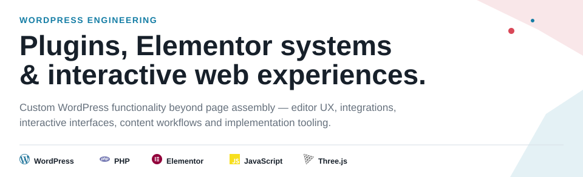
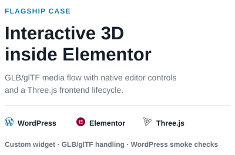
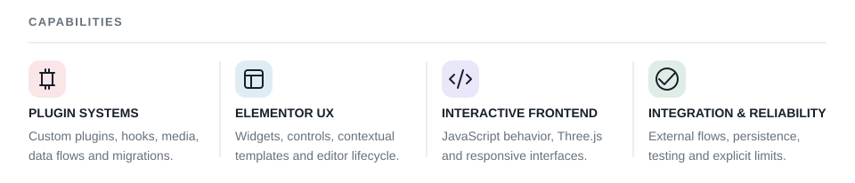
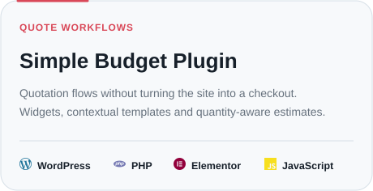
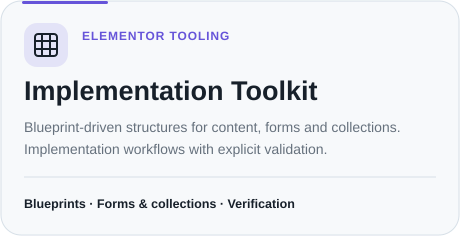
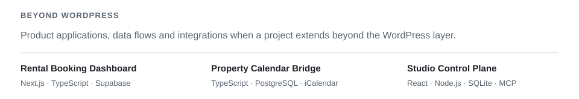

<picture>
  <source media="(prefers-color-scheme: dark)" srcset="./assets/profile/hero-dark.svg">
  <source media="(prefers-color-scheme: light)" srcset="./assets/profile/hero-light.svg">
  
</picture>

  
  <picture>
    <source media="(prefers-color-scheme: dark)" srcset="./assets/profile/flagship-copy-dark.svg">
    <source media="(prefers-color-scheme: light)" srcset="./assets/profile/flagship-copy-light.svg">
    
  </picture>

<picture>
  <source media="(prefers-color-scheme: dark)" srcset="./assets/profile/capabilities-dark.svg">
  <source media="(prefers-color-scheme: light)" srcset="./assets/profile/capabilities-light.svg">
  
</picture>

  <a href="https://github.com/KingDonRush/simple-budget-plugin">
    <picture>
      <source media="(prefers-color-scheme: dark)" srcset="./assets/profile/budget-dark.svg">
      <source media="(prefers-color-scheme: light)" srcset="./assets/profile/budget-light.svg">
      
    </picture>
  </a>
  <a href="https://github.com/KingDonRush/elementor-implementation-toolkit">
    <picture>
      <source media="(prefers-color-scheme: dark)" srcset="./assets/profile/toolkit-dark.svg">
      <source media="(prefers-color-scheme: light)" srcset="./assets/profile/toolkit-light.svg">
      
    </picture>
  </a>

<picture>
  <source media="(prefers-color-scheme: dark)" srcset="./assets/profile/breadth-dark.svg">
  <source media="(prefers-color-scheme: light)" srcset="./assets/profile/breadth-light.svg">
  
</picture>

  <a href="https://github.com/KingDonRush/rental-booking-dashboard">Rental Booking Dashboard</a>
  &nbsp;·&nbsp;
  <a href="https://github.com/KingDonRush/property-calendar-bridge">Property Calendar Bridge</a>
  &nbsp;·&nbsp;
  <a href="https://github.com/KingDonRush/studio-control-plane">Studio Control Plane</a>

<strong>How I work</strong>

I use coding agents, including OpenAI Codex, as part of an agent-assisted workflow:
I define scope and constraints, review implementation changes, run verification and
keep explicit boundaries between implemented behavior and future direction.

  Santa Catarina, Brasil · <a href="mailto:guilherme.manoelbbs@gmail.com">Email</a>

