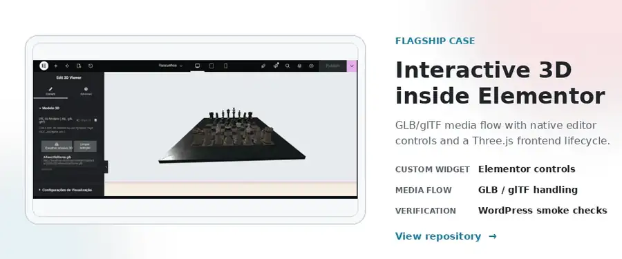
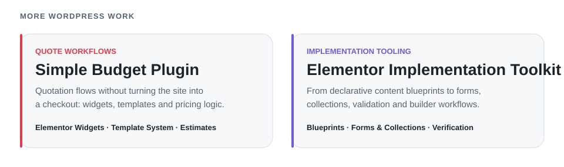

<picture>
  <source media="(prefers-color-scheme: dark)" srcset="./assets/profile/hero-dark.svg">
  <source media="(prefers-color-scheme: light)" srcset="./assets/profile/hero-light.svg">
  
</picture>

<a href="https://github.com/KingDonRush/3d-viewer-to-wordpress">
  <picture>
    <source media="(prefers-color-scheme: dark)" srcset="./assets/profile/flagship-dark.webp">
    <source media="(prefers-color-scheme: light)" srcset="./assets/profile/flagship-light.webp">
    
  </picture>
</a>

  <a href="https://github.com/KingDonRush/3d-viewer-to-wordpress"><strong>View repository</strong></a>
  &nbsp;&nbsp;·&nbsp;&nbsp;
  <a href="https://github.com/KingDonRush/3d-viewer-to-wordpress/blob/main/docs/media/elementor-3d-viewer.gif">Working animation</a>

<picture>
  <source media="(prefers-color-scheme: dark)" srcset="./assets/profile/capabilities-dark.svg">
  <source media="(prefers-color-scheme: light)" srcset="./assets/profile/capabilities-light.svg">
  
</picture>

<picture>
  <source media="(prefers-color-scheme: dark)" srcset="./assets/profile/cases-dark.svg">
  <source media="(prefers-color-scheme: light)" srcset="./assets/profile/cases-light.svg">
  
</picture>

  <a href="https://github.com/KingDonRush/simple-budget-plugin"><strong>Simple Budget Plugin</strong></a>
  &nbsp;&nbsp;·&nbsp;&nbsp;
  <a href="https://github.com/KingDonRush/elementor-implementation-toolkit"><strong>Elementor Implementation Toolkit</strong></a>

<picture>
  <source media="(prefers-color-scheme: dark)" srcset="./assets/profile/breadth-dark.svg">
  <source media="(prefers-color-scheme: light)" srcset="./assets/profile/breadth-light.svg">
  
</picture>

  <a href="https://github.com/KingDonRush/rental-booking-dashboard">Rental Booking Dashboard</a>
  &nbsp;·&nbsp;
  <a href="https://github.com/KingDonRush/property-calendar-bridge">Property Calendar Bridge</a>
  &nbsp;·&nbsp;
  <a href="https://github.com/KingDonRush/studio-control-plane">Studio Control Plane</a>

<strong>How I work</strong>

I use coding agents, including OpenAI Codex, as part of an agent-assisted workflow:
I define scope and constraints, review implementation changes, run verification and
keep explicit boundaries between implemented behavior and future direction.

  Santa Catarina, Brasil · <a href="mailto:guilherme.manoelbbs@gmail.com">Email</a>

